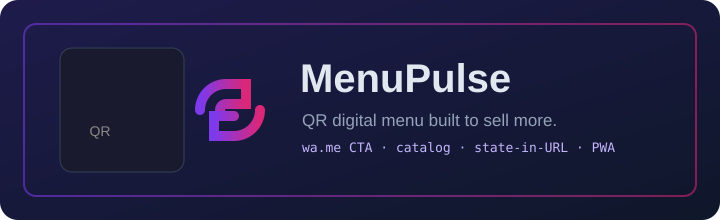

<div align="center">



# 📋 MenuPulse

**QR digital menu that sells more.**

[](https://github.com/chr-z/menupulse/actions/workflows/ci.yml)
[](LICENSE)
[](manifest.json)
[]()
[]()

🔗 **Live demo:** **[chr-z.github.io/menupulse](https://chr-z.github.io/menupulse/)** · no signup, free forever

</div>

---

Restaurant QR codes live on every table. MenuPulse turns that QR into a **mini storefront**: diners see the menu, add items, and checkout with a WhatsApp order. The restaurant owner gets a shareable link that encodes the entire order in the URL — no server, no subscription, zero ongoing cost.

## ✨ Features

- 📱 **QR-to-link** — scan the QR → see the digital menu on any phone
- 🛍️ **Item catalog** — unlimited items, per-item pricing, whole-order discount
- 💬 **WhatsApp CTA** — auto-built `wa.me` deep link with pre-filled order message
- 🌍 **Global-first i18n** — English & Português (BR) out of the box, header language selector
- 💱 **Multi-currency** — BRL, USD, EUR via `Intl.NumberFormat`; accepts both `1.234,56` and `1,234.56` price formats
- 🔗 **State-in-URL sharing** — the entire order is encoded in the share link (`?d=…`), nothing ever touches a server
- 💾 **Auto-save + JSON export/import** — drafts persist in `localStorage`
- ⚡ **PWA** — installable, offline-first service worker
- ♿ **Accessible** — semantic forms, labels, focus states

## 🚀 Get started in 30 seconds

1. Open the [demo](https://chr-z.github.io/menupulse/)
2. Type your restaurant name, WhatsApp number and menu items
3. Hit **Share link** → print the QR or paste it on your table tents

That's the whole onboarding.

## 💰 Pricing

| | Free |
|---|---|
| QR digital menu page | ✅ |
| WhatsApp CTA + catalog | ✅ |
| Items per menu | unlimited |
| Themes & custom colors | — |
| Click analytics | — |
| Price | **R$ 0** |

## 🗺️ Roadmap

- [ ] Theme picker + cover image
- [ ] QR code generator for the share link (embed in the page)
- [ ] Item categories & search
- [ ] Optional click counter (still serverless, via URL beacons)
- [ ] More languages (ES first)

## 🧑‍💻 Development

```bash
npm test          # business logic: phones, wa.me links, currency, catalog math
npm run serve     # local dev server at http://localhost:8080
```

Zero runtime dependencies. Pure ES modules + `Intl`. Node ≥ 18 for tests.

## Built by [@chr-z](https://github.com/chr-z)

Part of a fleet of free, no-backend micro-SaaS tools. If it's useful, a ⭐ helps more restaurants find it.

## License

[MIT](LICENSE)